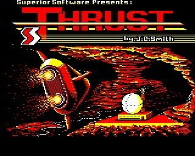

# Reverse engineering of original BBC micro game "Thrust"

Sourced from: https://bbcmicro.co.uk/explore.php?id=432. Binary files can be found in folder `./doc/disk-image`.

## !BOOT

- Load address: `0000`
- Exec address: `0000`
- Length: `002F`
- Summary: appears to be a BBC basic script that initializes & calls `THRUST` (next binary along)
  - `BASIC` — switches the interpreter back to BASIC (in case it was in another mode)
  - `PAGE=&1900` — sets the start address of the BASIC program in memory to &1900 (hex), moving it higher than the default to reserve space (likely for the assembler/machine code that lives below it)
  - `*FX21` — flushes the keyboard buffer (OS call)
  - `CLOSE#0` — closes all open files
  - `CHAIN "THRUST"` — loads and runs the next program file called "THRUST"

```basic
*BASIC
PAGE=&1900
*FX21
CLOSE#0:CHAIN "THRUST"
```

## THRUST

- Load address: `1900`
- Exec address: `1900`
- Length: `0229`
- Summary: A compact initialisation and loader routine:
  - Line 10 \*FX200,3 — disables the BREAK key (prevents accidental resets)
  - Line 20 ONERROR A — on any error, jump to label A (error handling/recovery, likely restarting something)
  - Line 30 \*TV0 — sets TV display to default (0,0 — no vertical shift), ensuring correct screen position
  - Line 40 — several things in sequence:
    - MODE7 — sets Teletext screen mode (least memory usage, ~1KB)
    - VDU23;8202;0;0;0; — disables the cursor
    - FORI%=0TO435STEP4:I%!HIMEM=I%!TOP:NEXT — copies a block of memory (435 bytes, word by word) from TOP (end of BASIC program) up to HIMEM. This is likely relocating the machine code or some data upward in memory
    - VDU28,1,23,39,13 — defines a text window (columns 1–39, rows 13–23), restricting output to the lower portion of the screen
    - I=INKEY300 — waits ~5 seconds (300 centiseconds) for a keypress, probably showing a title screen or message
  - Line 50 — PAGE=&1100 sets the BASIC program load address to &1100, then CHAIN"THRUST?" loads and runs the next program

```basic
10*FX200,3
20ONERRORA
30*TV0
40MODE7:VDU23;8202;0;0;0;:FORI%=0TO435STEP4:I%!HIMEM=I%!TOP:NEXT:VDU28,1,23,39,13:I=INKEY300
50PAGE=&1100:CHAIN"THRUST?"
```

## THRUST?

- Load address: `1100`
- Exec address: `1AB0`
- Length: `0A43`
- Summary: Game intro & instruction screen with page breaks, then launches the machine code in "THRUST3".

```basic
    10REM (C) J.C.Smith
    11GOSUB100:REM
    20*LOAD THRUST2 2000
    30MODE5
    40VDU23;8202;0;0;0;
    50VDU28,0,31,19,28
    60CALL&1A80
    70*RUN THRUST3
    80
   100MODE7:VDU23;8202;0;0;0;:A$="  Thrust":FORI%=0TO1:VDU&9D84;&8D;&83:PRINTTAB(19-LENA$DIV2,VPOS)A$:NEXT:PRINT'"ƒThe Mission:"
   110PRINT"…The Resistance is about to launch a    …major offensive against the Empire.    …In preparation for this, they have     …captured several starships, but they   …lack the essential power sources for"
   120PRINT"…these formidable craft, Klystron Pods. …You have been commissioned by the"
   130PRINT"…Resistance to steal these pods from the…Empire's storage planets. To do so, you…must locate the pod, hover just above  …it, activate your spaceship's tractor  …beam and thrust away from the pod."
   140PRINT"…Once the beam has locked onto the pod, …you can deactivate the tractor beam.   …You must then carry the pod away from  …the planet. You receive a bonus at the …end of each successful mission."
   150PRINT"…Note that some planets have ¢reverse   …gravity¢ or ¢invisible landscapes¢."''"„‡ˆ PRESS THE SPACE BAR TO CONTINUE";:VDU28,0,23,39,3:PROCP:PRINT"ƒThe Planet's Reactor:"
   160PRINT"…Each planet has a reactor providing    …power for the limpet guns. Shooting the…reactor will damage it, and the guns   …will cease firing until power can be   …restored. The more damage done, the"
   170PRINT"…longer this will take. If you shoot the…reactor repeatedly, it will become     …critically damaged. You will then have …a limited amount of time to escape"
   180PRINT"…before the reactor explodes and the    …planet is destroyed. If this happens,  …and you have not collected the pod,    …then the mission has failed."
   190PRINT"…If you retrieve the pod, send the      …reactor into its critical phase and    …leave the planet safely, you receive   …an extra bonus of 2000 points.":PROCP:PRINT"ƒAutomatic Limpet Guns:"
   200PRINT"…These guns are the planets' defence    …system."'"…Accurate shooting from your spaceship  …will destroy the limpet guns."''"ƒFuel Tanks:"
   210PRINT"…To collect fuel, hover just above a    …fuel tank and activate the tractor     …beam."''"ƒScoring:"'"…Destroying a limpet gun .... 750 points…Destroying a fuel tank ..... 150 points…Collecting a fuel tank ..... 300 points"
   220PRINT"…An extra spaceship is awarded for every…10000 points scored."''TAB(1)CHR$132;"Copyright (C) Superior Software 1986":REPEATUNTILGET=32:RETURN
   230DEFPROCP:*FX15
   240REPEATUNTILGET=32:CLS:ENDPROC:
```

## THRUST2

- Load address: `2000`
- Exec address: `2000`
- Length: `2300`
- Summary: Appears to contain screen shots of the main game in various different resolutions.



## THRUST3

- Load address: `1A00`
- Exec address: `5720`
- Length: `3D6E`
- Summary: The main machine code binary (6502 assembler). It features a multi-stage loader and an in-place decryption
  routine. The full raw data is shown in [hexdump.txt](./hexdump.txt). The decrypted and annotated assembly code is
  shown in [disassembly.asm](./disassembly) (sourced from https://github.com/kieranhj/thrust-disassembly). 


### Memory Map (Approximate)

| Address Range | Component | Description |
|---------------|-----------|-------------|
| `0000 - 0B00` | OS / Workspace | BBC Micro system variables and BASIC workspace. |
| `1100 - 1B43` | `THRUST?` | Game intro BASIC program and initial machine code routines. |
| `1A00 - 576E` | `THRUST3` | Main game binary (overwrites `THRUST?` after intro). |
| `2000 - 4300` | `THRUST2` | Game assets, including graphics and level data. |
| `5720 - 576E` | Loader | Unencrypted entry point and decryption routine for `THRUST3`. |

### Loading Process & Execution Flow

1. **`!BOOT`**: Initializes the environment and chains `THRUST`.
2. **`THRUST`**: Sets up the display mode (`MODE 7`), disables the BREAK key, and reserves memory by moving a block of code to `HIMEM`.
3. **`THRUST?`**: Displays the mission briefing and instructions.
   - **`CALL &1A80`**: Executes a small machine code routine embedded at the end of the BASIC program.
   - **`*RUN THRUST3`**: Loads the main game binary at `1A00` and jumps to the entry point at `5720`.
4. **`THRUST3` Decryption**:
   - The routine at `5720` initializes pointers at `&80/&81` (pointing to `1A00`) and `&82/&83` (pointing to `1A01`).
   - It executes a complex "rolling" `EOR` decryption loop to decrypt the game code in-place from `1A00` upwards.
   - Once decrypted, it jumps to the main game loop (likely near `1A00`).

### Assembly Analysis Highlights (from `disassembly.asm`)

- **Initialization Loop (`5723 - 5730`)**:
  Prints a VDU sequence stored at `5732` to set up the screen:
  - `16 07`: `MODE 7`
  - `17 01 00...`: VDU 23,1,0 (Disable cursor)
- **Decryption Loop (`5718 - 571d` / `56ea - 570e`)**:
  An obfuscated routine that uses adjacent bytes as keys for an `EOR` operation, ensuring the main game logic is not visible in a static disassembly of the binary file.
- **System Calls**:
  - `JSR &FFEE`: `OSWRCH` - Writes a character to the screen.
  - `JSR &FFF4`: `OSBYTE` - Used for various system settings (e.g., flushing buffers).

### Data Structures

- **Graphics Data (`THRUST2`)**: Found at `2000`, this area contains sprite definitions for the spaceship, pods, fuel tanks, and limpet guns. Patterns in the hexdump (e.g., `0f0f f0f0`) suggest 2-color or 4-color bitmask graphics suitable for the BBC Micro's teletext or high-res modes.
- **Level Definitions**: Likely stored within the decrypted portion of `THRUST3`, including gravity constants and landscape data (alluded to in the instruction screen as "reverse gravity" or "invisible landscapes").
